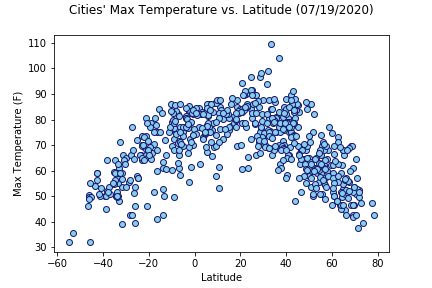
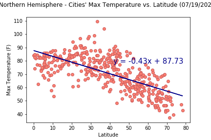
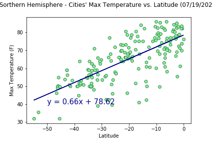
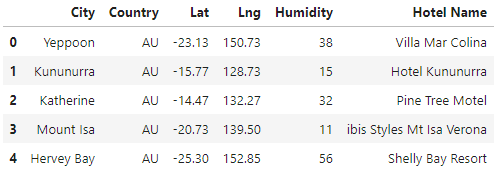
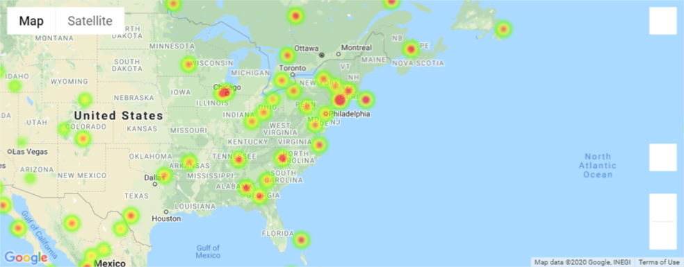
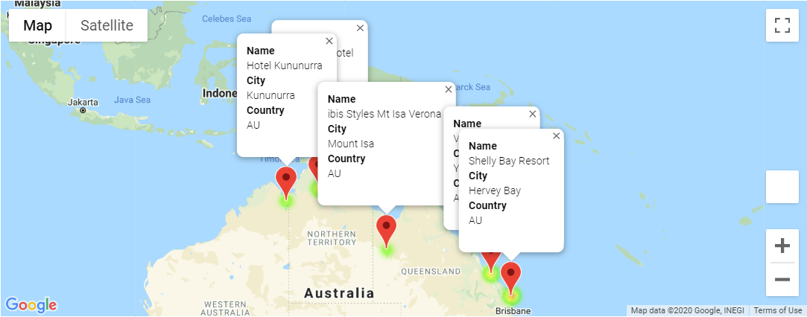

# Weather & Vacation

## Background

Objectives of this project is to use Python requests, APIs and JSON traversals:    
* To look into how weather conditions such as temperatures and humidity change as the latitude changes, and
* To identify ideal vacation spots and visualize accommodation information on Google Map

Used APIs:
* [OpenWeatherMap API](https://openweathermap.org/api)
* [Google Places API](https://bit.ly/32COEKo) 

## Part 1: Weather Analysis 

**1. Data collection and cleaning**
* Randomly generate a list of at least 500 cities using the `np.random.uniform()` method to reduce bias in data set
* Perform API calls to collect the **maximum temperatures**, **humidity**, **cloudiness** and **wind speed** of cities
* Inspect data to drop any irrelevant/missing data as needed
* Split data into Northern and Southern hemispheres

**2. Analysis and visualization**
* Plot various weather conditions against latitude data in a series of scatter plots using the whole data set. For exmaple:

* Repeat the scatter plots and add linear regressions using the Northern and Southern hemisphere data sets. For example:

**3. Final Observations**

* Only the maximum temperature vs. latitude analysis shows a strong correlation between both factors. 
* When the whole data set is split into the two hemispheres, the correlation between maximum temperature and latitude of one hemisphere is the exact opposite of the other's.
* Even when data shows some forms of clusters in the scatter plots (e.g. data seem to cluster in the lower wind speed range in wind speed vs. latitude), a closer examination using linear regression analysis would show there is no correlation between both factors.

## Part 2: Vacation Aanalysis

**1. Data collection and cleaning**
* Read in cities data prepared in Part 1
* Filter for ideal vacation spots using the following critieria:
    * Maximum temperature is between 70F and 85F
    * Cloudiness is less than or equals to 40%
    * Located in Australian
* Perform Google Places API calls to search for the nearest hotel to the vacation spots
* Use `.iterrows()` to make sure a search is performed on each of the 5 cities and store hotel names to dataframe:

* Use `info_box_template` to store hotel name, city and country information to be plotted on Google Map

**2. Visualization**
* Add heatmap layer to Google Map

* Add marker layer to Google Map

